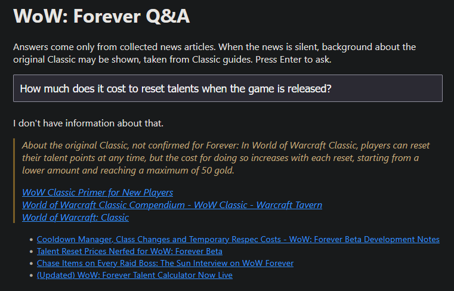

# wow-forever-rag

A question-answering bot for *World of Warcraft: Forever* that keeps itself up to date.

It collects news articles about the game on a schedule, indexes them, and answers questions using only what it has collected with sources. If the answer isn't in the collected articles, it says so instead of guessing.



```
$ python src/ask.py what is the level cap in beta
The level cap in the WoW: Forever Beta will start at level 20 and then increase
to level 30 at a later time. The cap will remain at 30 for the rest of Beta.
```

```
$ python src/ask.py what should I eat for dinner
I don't have information about that.
```

## Why

When I started this the announcement for World of Warcraft Forever was very recent and LLMs had not yet been trained on this new information. I saw this as an opportunity to explore something I was interested in: learning how to work with LLMs and experimenting with different ways they could be used. At the same time, I wanted to create something fun that I could share with my friends and that had a practical use.

This project is a retrieval-augmented generation (RAG) pipeline: instead of training a model, the relevant articles are found at question time and handed to the model as context. New articles show up in answers within hours of being published, with no retraining.

## How it works

```
Wowhead RSS feed ─┐
Seed URLs ────────┴─► fetch.py ──► data/raw/forever-news/       (Forever news)
Classic seed URLs ──► fetch.py ──► data/raw/classic-reference/  (Classic reference)
                                           │
                                           ▼
                                      index.py ──► data/index.sqlite   (150-word chunks + embeddings)
                                                           │
                                                           ▼
                         ask.py: query expansion + hybrid retrieval (BM25 + vector) ──► GPT-4o-mini ──► answer
```

**Fetch.** Articles are discovered through RSS feeds and a list of seed URLs for sources without feeds (Blizzard's own news site has none). Article text is extracted with `trafilatura`, preferring full-text feed content over page scraping. Each article is saved once, keyed by a hash of its URL, so the fetcher is safe to re-run at any time. Articles are stored in one subfolder per collection: `forever-news` for coverage of Forever itself, and `classic-reference` for a small, static set of guides to the original game. The folder decides the collection, and news answers are only ever retrieved from `forever-news`.

**Index.** Articles are split into overlapping 150-word chunks, each prefixed with its article title, and embedded with `text-embedding-3-small`. Chunks and vectors are stored in SQLite. The index is derived from the raw layer and can be rebuilt in a minute; changing the chunking never requires re-scraping.

**Ask.** The question is first rewritten by the model into three alternative phrasings, so a question asking about the "max level" can still match a source that says "adventure to level 60". Every phrasing is run through both BM25 keyword search and cosine similarity over the embeddings, and all the rankings are merged with reciprocal rank fusion. The top chunks go to the model with their source and publish date, and the model must return both an answer and the sentences from the sources that support it. Those sentences are checked against the retrieved text before the answer is shown; if none of them actually appears there, the answer is replaced with a refusal.

**Update.** `update.py` runs fetch and index together and is scheduled every 6 hours through the OS task scheduler, and notifies the running web server to reload the index.

**Background.** When the sources don't answer a question, the model may add general knowledge about the original Classic WoW, returned in a separate field and shown to the user as unverified. 


## Setup

Requires Python 3.11+ and an OpenAI API key.

```bash
git clone https://github.com/kejvano/wow-forever-rag.git
cd wow-forever-rag
python -m venv .venv
.venv\Scripts\activate          # Linux/macOS: source .venv/bin/activate
pip install -r requirements.txt
```

Create a `.env` file in the project root:

```
OPENAI_API_KEY=sk-...
```

Then populate the index and ask something:

```bash
python src/fetch.py
python src/index.py
python src/ask.py when does the game release
python src/ask.py what is Seal of Fury --debug   # shows retrieval scores
```

To keep the index current, schedule `src/update.py`. On Windows this is a Task Scheduler job; on Linux the equivalent cron entry is:

```
0 */6 * * * cd /path/to/wow-forever-rag && .venv/bin/python src/update.py >> logs/update.log 2>&1
```

## Web interface

```bash
uvicorn app:app --app-dir src
```

Open http://127.0.0.1:8000 for a minimal page: type a question, get an answer with links to the articles it was drawn from. FastAPI's generated API documentation is at http://127.0.0.1:8000/docs, where the endpoints can be tried directly.

| Endpoint | Description |
|---|---|
| `POST /ask` | `{"question": "..."}` → `{"answer": "...", "evidence": [...], "background": "...", "sources": [...]}` |
| `POST /reload` | Reloads the index from disk; called by `update.py` after each scheduled run so new articles are served without a restart. |

The index is loaded once at startup and held in memory, so nothing is read from the database per request. A question costs one rewrite call, one embedding call per phrasing, and one answer call roughly doubling latency compared to single-query retrieval, in exchange for far better recall on unusual phrasings.

## Evaluation

`eval/questions.json` holds a set of questions with expected answer fragments and, where known, the article the answer should come from. `python src/evaluate.py` runs them all and reports which cases fail at retrieval and which fail at generation.

This is a regression check, not a benchmark, but it has already earned its keep: with vector-only retrieval and 300-word chunks, the level-cap question failed because the relevant sentence was diluted inside a long chunk about several topics. Smaller chunks fixed it, and adding BM25 made the result stable across chunk sizes.

Refusal cases describe the corpus at a point in time, not permanent truths. Early on, "Will I be able to create characters of different factions on the same account?" had no answer in the sources, and the correct behaviour was to refuse. A week later Blizzard published the ruleset details, the scheduled update picked them up, and the bot began answering correctly which made the old test fail. When a refusal case starts failing after an update, the first thing to check is whether the sources have caught up.

## Design decisions

- **RAG, not fine-tuning.** The facts change weekly. Fine-tuning would need a retraining cycle per update and still tends to hallucinate specifics; retrieval makes the freshness problem a scheduling problem.
- **Raw layer kept separate from the index.** Scraping is the expensive, fragile step; embedding is cheap. Keeping raw text immutable makes every indexing experiment a one-minute rebuild.
- **SQLite with in-memory vector search.** A few hundred chunks fit in memory and brute-force cosine similarity runs in microseconds. A vector database would add operational weight for no benefit at this scale; pgvector is the natural next step if the corpus grows by orders of magnitude.
- **Hybrid retrieval.** Embeddings capture meaning but underweight exact terms; the game's vocabulary (ability names, item names, zone names) is exactly what keyword search is good at.
- **Multi-query retrieval.** A question's wording often shares nothing with the source that answers it. Blizzard's announcement says players will "adventure to level 60"; a user asks for the "max level", and neither keyword nor vector search connected them. Rewriting the question into several phrasings before retrieval fixed that class of miss.
- **Verified evidence.** The model must return verbatim quotes supporting its answer, and those quotes are checked against the retrieved chunks in code before the answer is shown. This caught a subtler kind of hallucination than an ungrounded fact: asked whether both factions could exist on one account, the model reasoned from a source saying they cannot group together and answered "yes", fluent, source-flavoured, and unsupported. With the check in place it refuses, because no source sentence says it. Quotes are verified sentence by sentence, because the model often merges adjacent sentences into one quote and alters a word in the join; each sentence must be at least six words long, so a trivial fragment can't count as evidence.
- **Refusal over guessing.** If nothing relevant is retrieved, the model isn't called at all. If sources are retrieved but don't contain the answer, the model is instructed to say so.

## Limitations

- Source coverage is narrow: one feed plus a hand-maintained seed list. Sources without RSS (including Blizzard's own site) are only picked up via seeds or secondhand coverage.
- Site-specific cleanup (`strip_trailing_nav`) is brittle by design and will need maintenance when Wowhead changes its page layout.
- No alerting. If a feed breaks or the API key expires, the only sign is the log.
- The evaluation set is small. It catches regressions on known cases; it doesn't measure overall answer quality.
- Overlapping chunks from the same article can both be retrieved, occasionally biasing the answer toward whichever phrasing appears twice.
- The background field is unverified model recall, not retrieval. In testing it stated that Classic allowed characters of both factions on one account, which is only true outside PvP realms, the caveat that mattered for the question being asked. It is labeled as unverified in the interface; grounding it in an indexed Classic reference corpus is the planned fix.
- The evidence check verifies that at least one supporting sentence appears verbatim in the retrieved text; it does not verify every claim in the answer.
- The Warcraft Tavern compendium in the Classic reference set was written shortly before Classic launched in 2019, so a few of its statements are predictions rather than facts.

## Possible next steps

- Index a Classic WoW reference corpus as a second collection so background answers are retrieved and evidence-checked like everything else.
- Merge adjacent chunks from the same article before sending them to the model.
- Local model support via Ollama for fully offline operation.
- Store the embedding model name with the index and refuse to mix models.
- Alerting on failed scheduled runs.